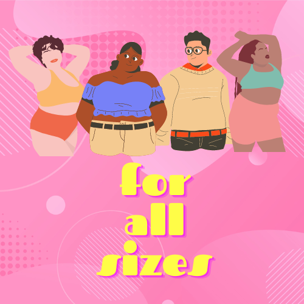
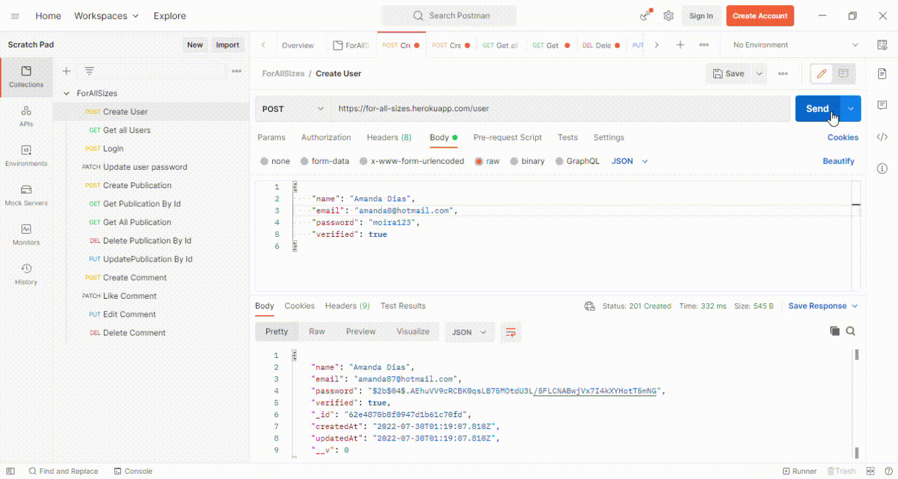
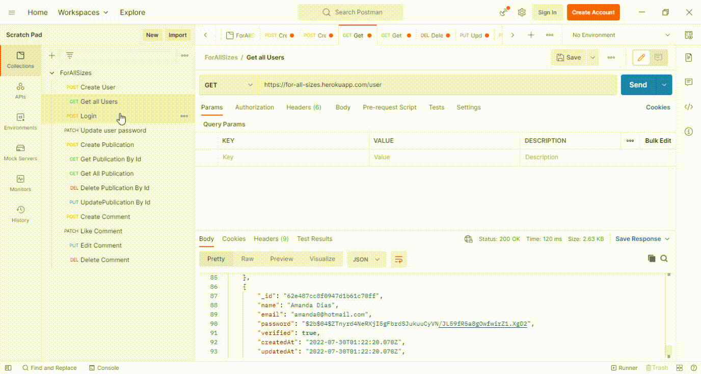
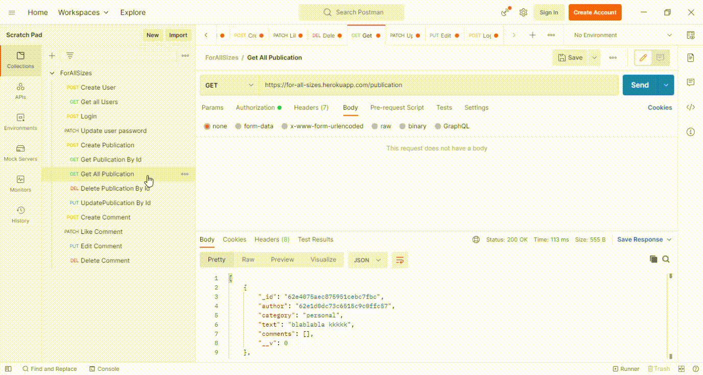
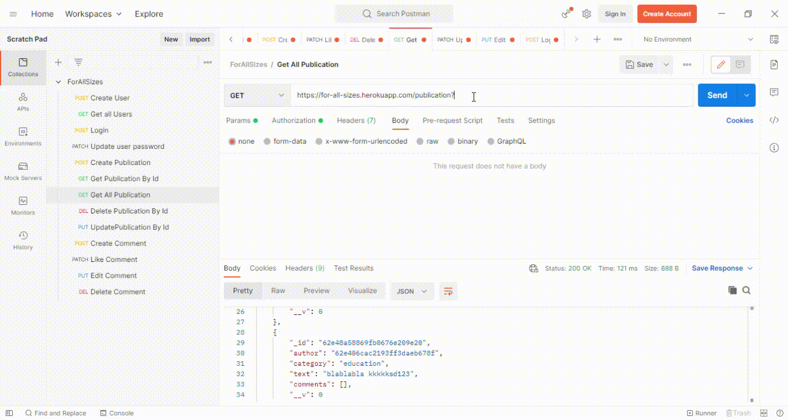
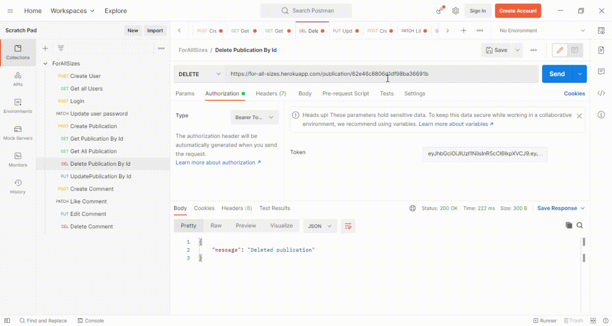
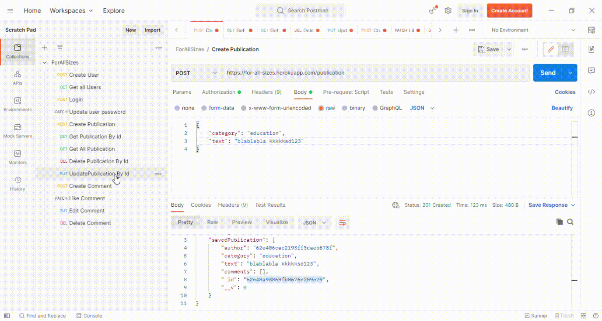
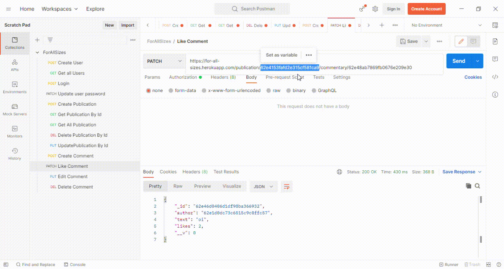
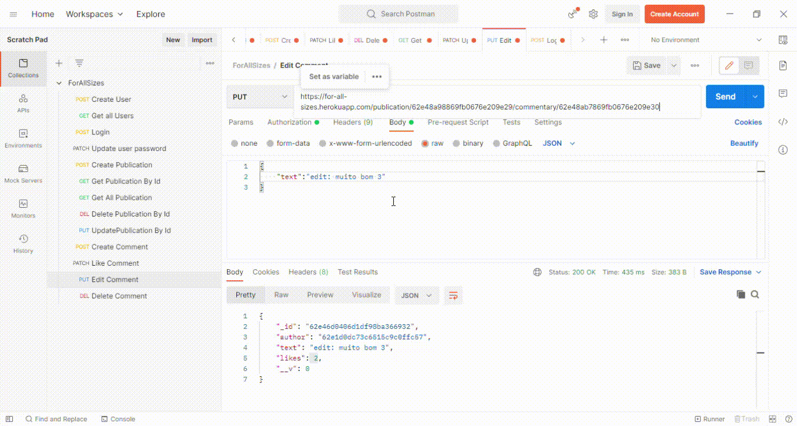
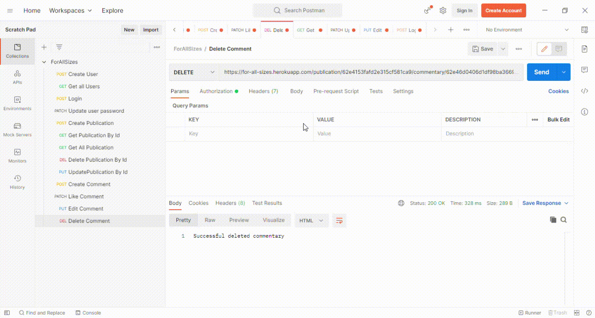

<h1 align="center">
    <br>
    <p align="center">PROJETO: FOR ALL SIZES<p>
</h1.>

<p align="center">
</p>
<br>


<p align="justify"> Olá, seja bem vind@! Este projeto foi desenvolvido para demonstrar os conhecimentos adquiridos durante o  curso "Todas em Tech", da {reprograma}. 


# 📚JUSTIFICATIVA:

<p align="justify">
A presença de influencers gordes nas redes sociais nos últimos anos é notória. Suas publicações atingem um público alvo que busca pela integração e aceitação do seu próprio corpo, na tentativa de estabelecer uma comunidade que possa  reafirmar a sua existência, lutando em meio a tantos discursos de ódio.  Contudo, apesar de contribuir para a inclusão das pautas de luta contra a gordofobia, é também nestas redes que estres grupos sofrem ataques. Influencers como: Thais Carla, Jéssica Lopes, Enam Asiam, Luciene Barros, Christian Johannes, Akeen, dentre muitos outros do meio, demonstram a importância de bater de frente contra preconceito institucionalizado pelos discursos médicos e midiáticos. Segundo a jornalista da CNN, Agnes Arruda: “A gordofobia é um preconceito contra pessoas gordas geralmente associado à questão estética, mas é mais profundo do que isso. Ela retroage em vários ambientes, segregando do convívio social, familiar, mercado de trabalho, limitando a vida da pessoa.”

<p align="justify">
É possível observar os ataques sofridos por estes influencers e também pelo público que os acompanha. Sabendo da importância de preservar esta luta e na intenção de criar um portal seguro para estas pessoas, foi desenvolvido o projeto FOR ALL SIZES.


## 🔎 SOBRE A API:

<p align="justify">
O projeto "For All Sizes" tem como objetivo a criação de um espaço seguro para pessoas gordas, de modo que estas possam compartilhar através de postagens e comentários, suas vivências, debates e leis que na conquista de direior e criminalização da gordofobia, serviços, moda e auto estima. 
 Para isso, o cadastro de usuários foi divido da seguinte maneira:

 - **Usuários verificados**: Os influencers e lojistas que trabalham com a comunidade plus size passarão pelo processo de autenticação, garantindo a segurança de seus perfis. A partir disso, poderão fazer publicações divididas em três categorias: educação, pessoal e publicidade; Também poderão excluir comentários considerados maldosos e gerenciar sua postagem.
 - **Usuários públicos**: São os seguidores dos influencers e lojistas. Eles também poderão ter um login e senha, porém, apenas podendo comentar e deixar like nas publicações.

## ⚙️ FUNCIONALIDADES:

- Listar todos os Usuários da API;
- Cadastro de Usuários Verificados;
- Cadastro de Usuários Públicos;
- Criação, atualização e exclusão de postagens;
- Alteração de senhas;
- Criação, atualização, like e exclusão de comentários.


## 💻 MÉTODOS:
<p align="justify">
Foi desenvolvida uma API com o método CRUD: Create, Read, Update e Delete. Foram acrescentadas as rotas  necessárias para cada função e também o processo de autenticação para segurança da API. Na execução do banco de dados foi utilizado o MongoDB; E para os testes e ajuste de erros foi utilizado o Postman.

## 📂 ARQUITETURA MVC
```
 📁PROJETO FINAL
   |
   |-  📁 src
   |    |
   |    |- 📁 controllers
   |         |- 📑 publicationController.js
   |         |- 📑 userController.js
   |
   |    |- 📁 database
   |         |- 📑 MongoConfig.js
   |
   |    |- 📁 models
   |         |- 📑commentary.js
   |         |- 📑publication.js
   |         |- 📑user.js
   |
   |    |- 📁 routes
   |         |- 📑publicationRoutes.js 
   |         |- 📑 userRoutes.js
   |
   |    |- 📑 app.js
   |
   |
   |- 📑 .env
   |- 📑 .env.example
   |- 📑 .gitignore
   |- 📑 package-lock.json
   |- 📑 package.json
   |- 📑 Procfile
   |- 📑 README.me
   |- 📑 server.js
     
```

## 👨‍💻 TECNOLOGIAS E PACOTES UTILIZADOS:


**TECNOLOGIAS**

- [Git/GitHub](https://github.com/)
- [Heroku](https://dashboard.heroku.com/apps)
- [JavaScript](https://www.javascript.com/)
- [MongoDB Atlas](https://www.mongodb.com/cloud/atlas)
- [Node.js](https://nodejs.org/en/)
- [Postman](https://www.postman.com/)
- [VScode](https://code.visualstudio.com/)  

### PACOTES


- [Cors](https://www.npmjs.com/package/cors)
- [Dotenv-safe](https://www.npmjs.com/package/dotenv)
- [Express](https://expressjs.com/pt-br/)
- [Mongoose](https://mongoosejs.com/)
- [Nodemon](https://www.npmjs.com/package/nodemon)
- [JWT](https://jwt.io/)


# 🔃 ROTAS


## 🔃 ROTA INDEX

| Método HTTP  | Endpoint                     | Descrição                            |
| ------------ | ---------------------------- | ------------------------------------ |
| GET          | `http://localhost:9090/`     |  Apresentação do projeto    |             |

## 🔃 ROTAS - PUBLICAÇÕES

| Método HTTP  | Endpoint              | Descrição                                  |
| ------------ | --------------------- | ------------------------------------------ |
| GET          | `/publication`         | Lista todas as publicações e filtros de categoria e autor             |
| GET          | `/publication/:id`     | Encontra uma publicação por ID   |
| POST        | `/publication`         | Criação de uma publicação               |
| POST          | `/publication/:id/commentary`     | Criação de um comentário em uma publicação com ID fornecido  |
| PUT          | `/publication/:Id`         | Atualizar uma publicação             |
| PUT          | `/publication/:id/commentary/:commentaryId`     | Editar um determinado comentário de uma publicação fornecida  |
|PATCH       | `/publication/:id/commentary/:commentaryId`         | Deixar like em uma publicação             |
| DELETE          | `/publication/:id`     | Deletar uma publicação por ID  |
| DELETE          | `/publication/:id/commentary:commentaryId`     | Deletar um comentário por ID  |
    
    
## 🔃 ROTAS - USUÁRIOS

| Método HTTP  | Endpoint              | Descrição                                  |
| ------------ | --------------------- | ------------------------------------------ |
| GET          | `/user`         | Listar todos os usuários cadastrados            |
| POST          | `/user`     | Cadastra um novo usuário   |
| POST        | `/user/login`         | Criação de um login autenticado 
| PATCH          | `/user`     | Atualiza uma senha  |
| DELETE       | `/user/:id`         | Deleta um usuário a partir do ID fornecido            


## 🛑​ PARA REALIZAR A INSTALAÇÃO NO SEU COMPUTADOR:


1. Primeiro é necessário clonar o seguinte repositório:

    ```bash
    $ git clone https://github.com/amandadiass/ForAllSizes.git
     ```

2. Entre na seguinte pasta: 

    ```bash
    $ cd PROJETOFINAL/
    ```
    
3. Para prosseguir, é necessário baixas as dependências: 

   ```bash
    $ npm install
    ```
4. Inicie o projeto com o comando: 

   ```bash
    $ npm start
    ```   

<br>

---


# ✔️VISUALIZAÇÃO E FUNCIONAMENTO:


<br>

>Criando um usuário
<div align = "center">


</div>
<br>


<br>

>Listando todos os usuários cadastrados
<div align = "center">


</div>
<br>
<br>

>Realizando Login
<div align = "center">


</div>
<br>
<br>

>Atualizando a senha
<div align = "center">


</div>
<br>
<br>

>Criando uma publicação (apenas usuários autenticados).
<div align = "center">


</div>
<br>
<br>

>Encontrando uma publicação por ID:
<div align = "center">


</div>
<br>
<br>

>Listando todas as publicações
<div align = "center">


</div>
<br>
<br>

>Listando as publicações por categoria:
<div align = "center">


</div>
<br>
<br>

>Deletando publicações pelo ID:
<div align = "center">


</div>
<br>
<br>

>Atualizando publicação pelo ID:
<div align = "center">


</div>
<br>
<br>

>Criando um novo comentário (todos os usuários podem realizar esta ação):
<div align = "center">


</div>
<br>

>Deixando o Like em um comentário:
<div align = "center">


</div>
<br>
<br>

>Editando um comentário:
<div align = "center">


</div>
<br>
<br>

>Deletando um comentário:
<div align = "center">


</div>
<br>

## 🏗️ IMPLEMENTAÇÕES FUTURAS:

* Desenvolver o front end do projeto;
* Criar um espaço para administradores com funções que possam ajudar na segurança da comunidade;
* Ajustar o projeto para ser visualizado com o Swagger.

##  👩 SOBRE A AUTORA:


|Autora|Vivência|
|:------:|----|
|  | Oi mundo! Sou Amanda Dias, paraibana, professora e desenvolvedora Back End. Sou uma mulher gorda e lgbtqia+ 🏳️‍🌈 e minhas experiências me guiaram na construção desta API. Trabalho com crianças e adolescentes desde 2018; A partir do curso "Todas em Tech" da {reprograma}, passei a criar API's, estudar lógica e entender linguagens de programação, a exemplo do JavaScript. Estou ansiosa para saber os novos rumos desta carreira. Se quiser conversar ou tirar alguma dúvida, sinta-se a vontade para me procurar nas redes sociais. |

##  🌈 REDES SOCIAIS

#### [LinkedIn](https://www.linkedin.com/in/amandag-dias/);
#### [Instagram](https://www.instagram.com/amandxxbdias/);


## REFERÊNCIAS:

[https://www.uol.com.br/universa/noticias/redacao/2019/04/20/5-influencers-plus-size-que-merecem-o-seu-like-no-instagram.htm](https://www.uol.com.br/universa/noticias/redacao/2019/04/20/5-influencers-plus-size-que-merecem-o-seu-like-no-instagram.htm)

[https://humanas.blog.scielo.org/blog/2020/09/24/ativismo-gordo-contra-a-gordofobia-rompendo-paradigmas-corporeo-sociais/#.YuIB2HbMKUk](https://humanas.blog.scielo.org/blog/2020/09/24/ativismo-gordo-contra-a-gordofobia-rompendo-paradigmas-corporeo-sociais/#.YuIB2HbMKUk)

[https://redacaonline.com.br/temas-de-redacao/gordofobia-e-o-culto-ao-corpo-padrao](https://redacaonline.com.br/temas-de-redacao/gordofobia-e-o-culto-ao-corpo-padrao)


